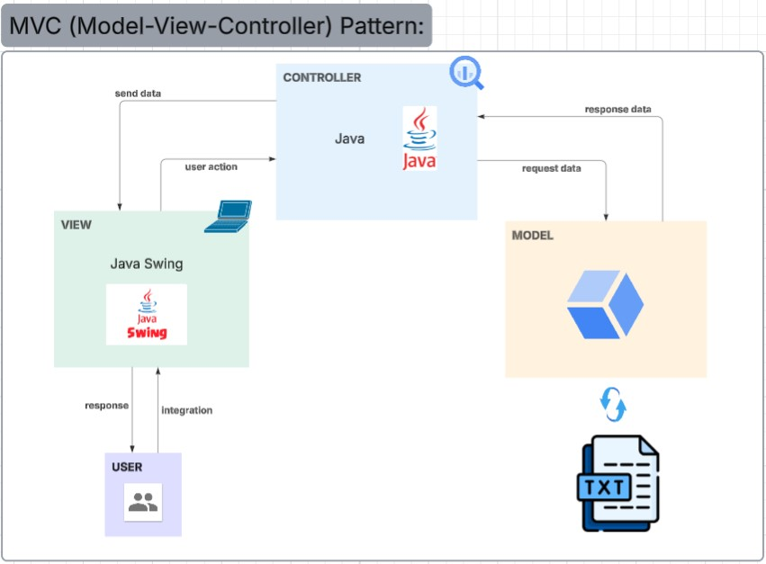

## Patrón de Arquitectura del Software

### Patrón aplicado: Modelo – Vista – Controlador (MVC)

El prototipo desarrollado implementa el **patrón arquitectónico Modelo–Vista–Controlador (MVC)**, el cual permite separar de forma clara la interfaz de usuario, la lógica de negocio y el manejo de datos del sistema. Este patrón mejora la organización, mantenibilidad y escalabilidad del código, ya que cada componente cumple una función específica: el **Modelo** contiene las clases del dominio, la lógica de negocio y la conexión a la base de datos o archivos de información; la **Vista** representa la interfaz gráfica con la que interactúa el usuario mediante ventanas o formularios; y el **Controlador** actúa como intermediario entre la vista y el modelo, procesando los eventos generados por el usuario y actualizando la vista cuando sea necesario. Gracias a esta separación, es posible modificar la interfaz sin alterar la lógica interna o actualizar las reglas de negocio sin afectar la presentación. El uso del patrón MVC, ampliamente soportado por entornos de desarrollo como **NetBeans** o **IntelliJ IDEA**, contribuye a un diseño más profesional, modular y estructurado del software.

---

  
  
<em>Figura 1. Estructura general del patrón Modelo–Vista–Controlador (MVC) aplicado en el sistema.</em>

