# Anexo C - Prototipos Figma - Tareas

## 1. Pantalla Inicial
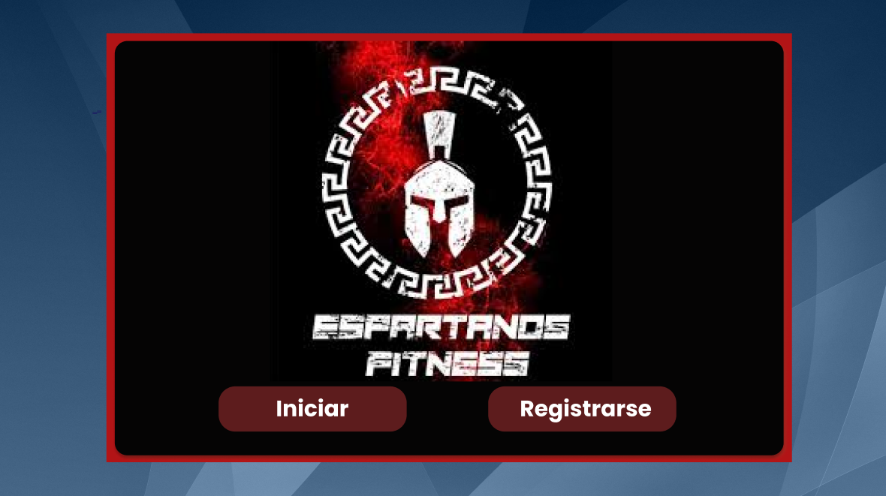

## 2. Pantalla de Login
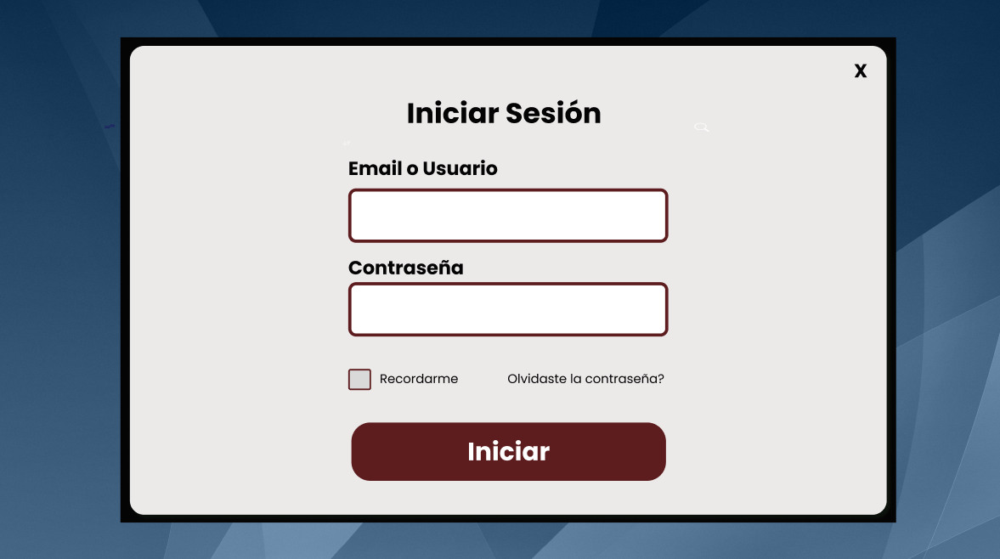

## 3. Pantalla de Registro
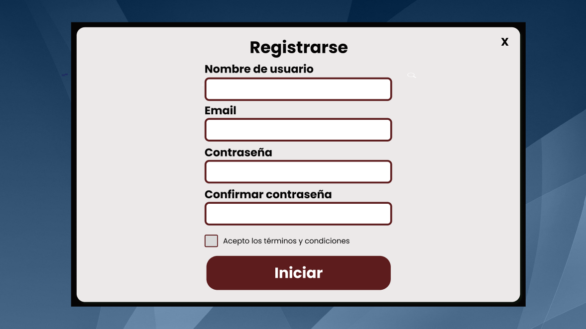

## 4. Pantalla Principal
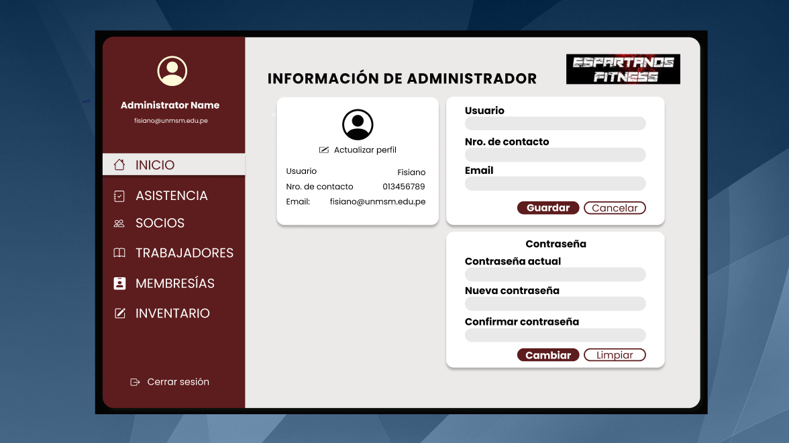

## 5. Pantalla de Asistencia
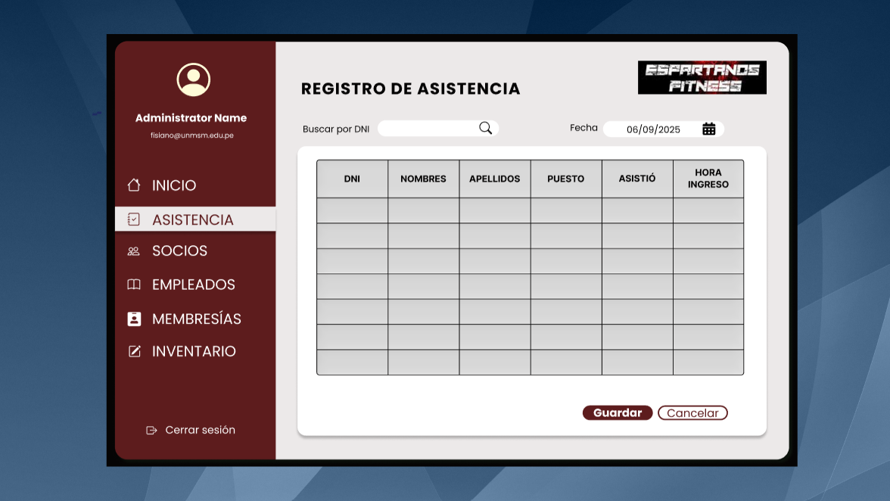

## 6. Gestión de Socios
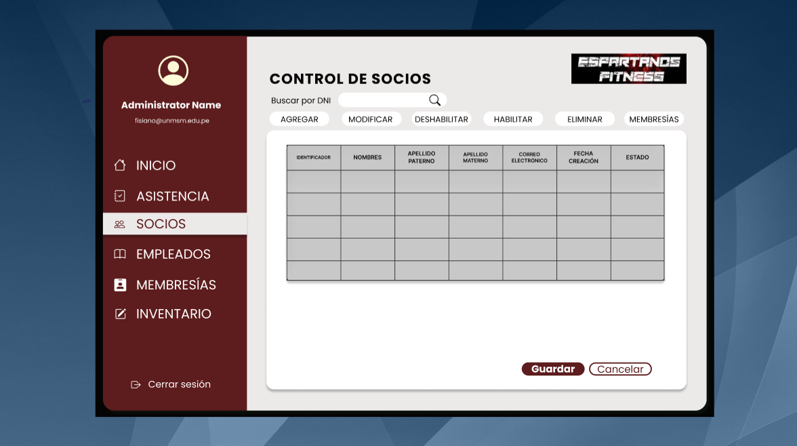

## 7. Gestión de Socios (Detalle 1)
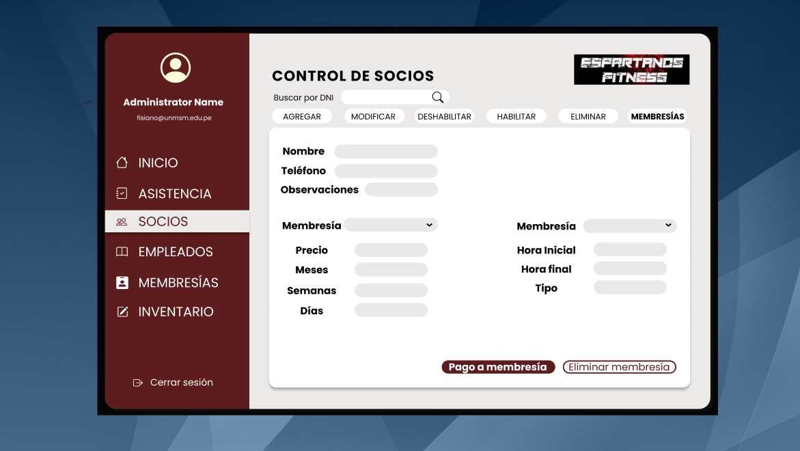

## 8. Gestión de Socios (Detalle 2)
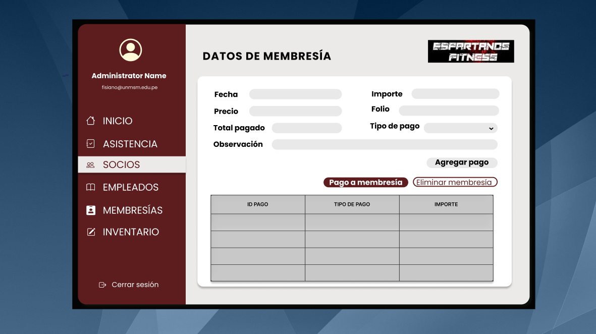

## 9. Gestión de Empleados
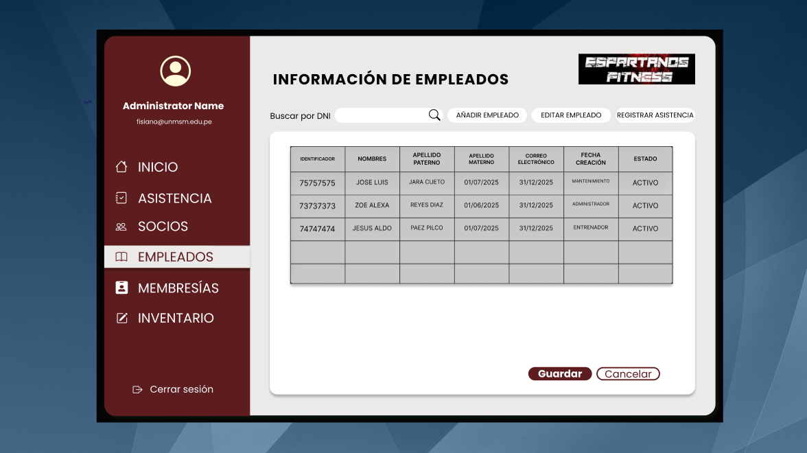

## 10. Gestión de Membresía 1
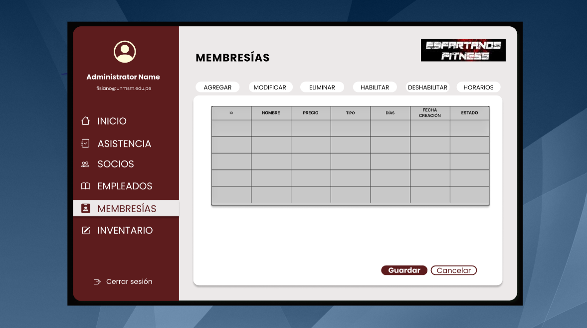

## 11. Gestión de Membresía 2
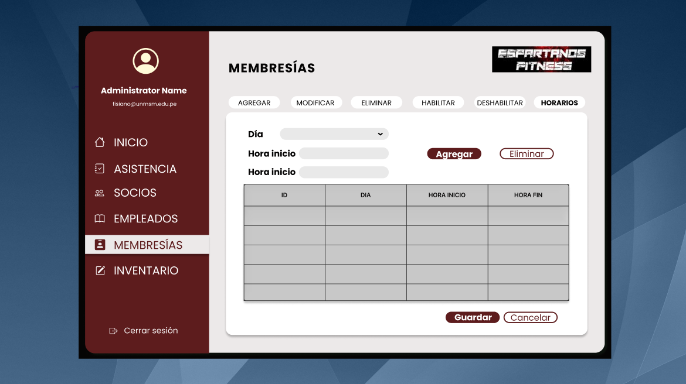

## 12. Inventario
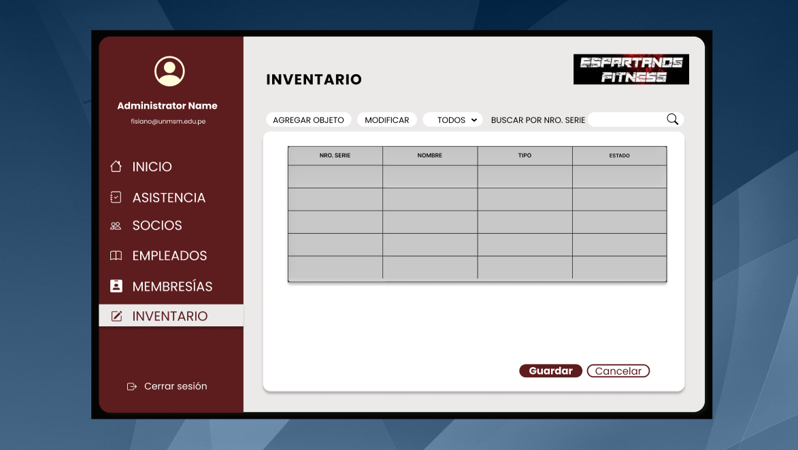
