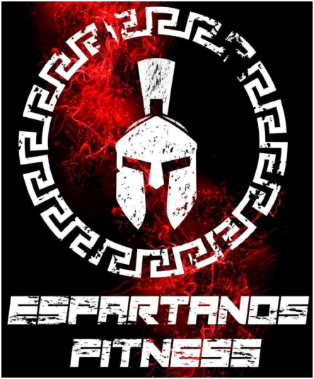

# Espartanos Fitness - Sistema de Gestion

  

## Introduccion

Este documento recoge los requisitos de usuario y la especificación técnica inicial para el sistema de gestión del gimnasio Espartanos Fitness (Fase 01). Está dirigido principalmente al administrador/propietario, pero también considera funcionalidades relevantes para entrenadores y socios. Se basa en la información del proyecto (info.pdf) y la guía del curso (curso-procesos-software).

## Tecnicas de obtencion de requisitos (Anexo A)

Técnicas utilizadas (previstas):

- Cuestionarios / Encuestas (Google Forms) para administrador.
- Observación directa (flujo de recepción, cobros).
- Prototipos en Figma (wireframes) para validar pantallas clave.
- Entrevistas grabadas por Google Meet con el cliente (por confirmar).

## Stakeholders

Partes interesadas principales:

- Administrador : Usuario principal; gestiona socios, membresías, pagos, horarios, empleados y reportes.

## Requisitos de usuario

Resumen de los requisitos principales en lenguaje sencillo (orientado al admin):

- **Autenticación y seguridad:** Iniciar sesión como administrador.

- **Gestión de socios:** Registrar, consultar, actualizar y eliminar fichas de socios con datos personales.

- **Gestión de membresías y pagos:** Crear planes, asignarlos a socios, registrar pagos, calcular vencimientos y restricciones de acceso.

- **Gestión de inventario:** Registrar máquinas, discos, mancuernas y otros equipos, controlar estados y categorizarlos.

- **Gestión de empleados:** Registrar empleados, controlar asistencia y generar reportes diarios.

- **Reportes:** socios, empleados, pagos, membresias, asistencia de empleados e inventario.
